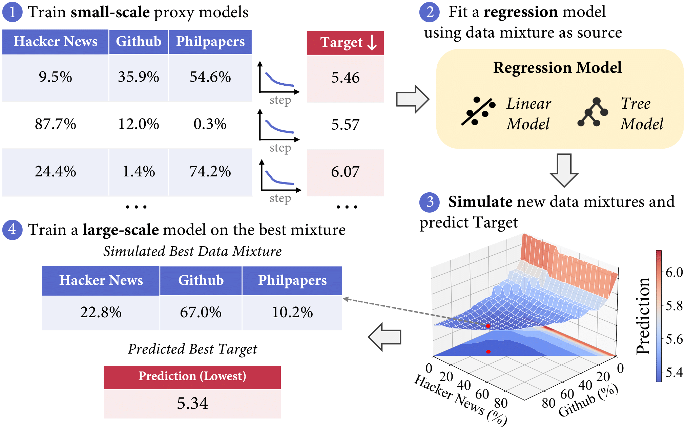

# 🧬 RegMix: Data Mixture as Regression for Language Model Pre-training

The official repo of the [RegMix](https://huggingface.co/papers/2407.01492) paper.

### Overview

RegMix is a method for automatically identifying an effective data mixture for training large language models (LLMs). The key idea is to formulate the data mixture selection as a **regression task**, where a set of small "proxy" models are trained on diverse data mixtures, and their performance is used to fit a regression model. This regression model is then used to predict and simulate the optimal data mixture, which is then used to train a large-scale LLM.



## Quickstart

This repo contains three parts of the code for our RegMix method:

- `mixture_config`: code for synthesizing and visualizing data mixtures used in the experiments described in the paper.
- `regression_fitting`: code for fitting the regression model and for predicting the optimal data mixture.
- `model_training`: code for training the proxy models (e.g., 1M) and the large language models (e.g., 1B) using the awesome [TinyLlama](https://github.com/jzhang38/TinyLlama) codebase.
- `evaluation`: code for reproducing the evaluation results of our models. [WIP, In progress]

## Release

We have released both the data and the models on HuggingFace. You can find the data and models in the following table:


## Evaluation [WIP, In progress]

We provide the evaluation code for the models in the `evaluation` directory.

## Citation

If you find our work helpful, please consider citing our paper:

```bibtex
@misc{liu2024regmix,
      title={RegMix: Data Mixture as Regression for Language Model Pre-training}, 
      author={Qian Liu and Xiaosen Zheng and Niklas Muennighoff and Guangtao Zeng and Longxu Dou and Tianyu Pang and Jing Jiang and Min Lin},
      year={2024},
      eprint={2407.01492},
      archivePrefix={arXiv},
      primaryClass={cs.CL},
      url={https://arxiv.org/abs/2407.01492}, 
}
```

## Contact Us

If you are interested for our work or you have any questions, please feel free to contact us via email: liuqian@sea.com or xszheng.2020@phdcs.smu.edu.sg.