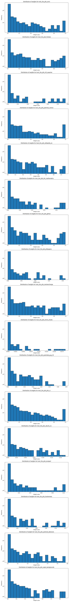

## Data Mixture Configuration

This directory contains scripts for synthesizing and visualizing data mixtures used in the experiments described in the paper.

### synthesize_mixture.py

This script is used to synthesize data mixtures for training the proxy models (1M models in the paper). By default, it generates 512 configurations following the settings specified within the script. The configurations are saved in the `config_1m` directory.

### visualize_mixture.py

This script is used to visualize the data mixtures generated for training the proxy models. By default, it visualizes the configurations stored in the `config_1m` directory. The visualizations are saved in `weight_distributions.png`.

If you want to visualize a different folder, you can use the following command:

```shell
python visualize_mixture.py --folder <path_to_config_dir>
```

Note that the folder must contain several yaml files which starts from `n` and ends with `.yaml`.

## Weight Distribution

The following image illustrates a possible weight distribution for the data mixtures:


